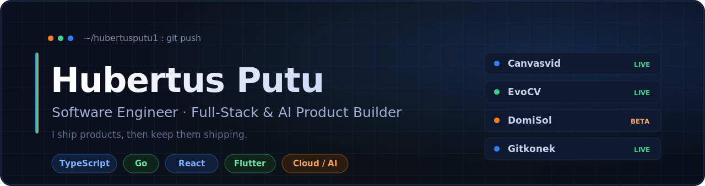

<!--
  GitHub Profile README for @hubertusputu1
  Repo must be named exactly:  hubertusputu1
  Files expected in repo root:  README.md, banner.png
  Snake animation: add .github/workflows/snake.yml and run it once (see setup notes).
-->

  
  
  

---

## 🚀 What I'm working on

I'm a **Software Engineer at [SageReport](https://sagereport.com)**, and I run **[Gitkonek](https://gitkonek.com)**, a software house that builds, ships, and maintains products for founders over the long haul. Most of what I build, I keep running.

- 🔭 Currently shipping products across **web, mobile, and AI**
- 🌱 Going deep on **Go**, edge infra (**Cloudflare**), and applied **AI/LLM** features
- 💬 Ask me about **full-stack TypeScript**, **Flutter / React Native**, or building solo-founder-friendly SaaS
- 📫 Reach me at **putu@gitkonek.com**

---

## 🛠️ Tech Stack

<b>Languages:</b> TypeScript · JavaScript · Go · SQL &nbsp;&nbsp;|&nbsp;&nbsp; <b>Frontend:</b> React · React Native · Flutter · Tailwind &nbsp;&nbsp;|&nbsp;&nbsp; <b>Backend/Data:</b> Node.js · PostgreSQL · MongoDB · Firebase · Supabase &nbsp;&nbsp;|&nbsp;&nbsp; <b>Cloud:</b> Cloudflare · AWS · GCP

---

## 📂 Active Projects

<table>
  <tr>
    <td width="50%" align="center" valign="top">
      
        
      <strong><a href="https://canvasvid.app">Canvasvid</a></strong> &nbsp;·&nbsp; ✅ Live
       
      AI explainer-video generator. Turn one sentence into a polished, narrated video (script, AI voice, scenes, subtitles) in minutes.
    </td>
    <td width="50%" align="center" valign="top">
      
        
      <strong><a href="https://evocv.com">EvoCV</a></strong> &nbsp;·&nbsp; ✅ Live
       
      AI CV builder & job-fit platform. ATS-optimized CVs, an EvoScore match check, cover letters, and discovery for SEA tech talent.
    </td>
  </tr>
  <tr>
    <td width="50%" align="center" valign="top">
      
        
      <strong><a href="https://domisol.app">DomiSol</a></strong> &nbsp;·&nbsp; 🧪 Public beta
       
      Web-based tonic solfa & jianpu music notation editor. Compose, play back, arrange SATB, and export print-ready hymns and choral scores.
    </td>
    <td width="50%" align="center" valign="top">
      
        
      <strong><a href="https://gitkonek.com">Gitkonek</a></strong> &nbsp;·&nbsp; ✅ Live
       
      Software-house agency. Senior full-stack engineering that builds, ships, and maintains founders' products long-term.
    </td>
  </tr>
</table>

---

## 📊 GitHub

 

<picture>
  <source media="(prefers-color-scheme: dark)" srcset="https://raw.githubusercontent.com/hubertusputu1/hubertusputu1/output/snake-dark.svg" />
  <source media="(prefers-color-scheme: light)" srcset="https://raw.githubusercontent.com/hubertusputu1/hubertusputu1/output/snake.svg" />
  
</picture>

---

💡 <em>"We don't launch and leave."</em> Building things that keep shipping.

<a href="https://www.linkedin.com/in/hubertus-putu">LinkedIn</a> &nbsp;·&nbsp;
<a href="https://gitkonek.com">gitkonek.com</a> &nbsp;·&nbsp;
<a href="mailto:putu@gitkonek.com">putu@gitkonek.com</a>

